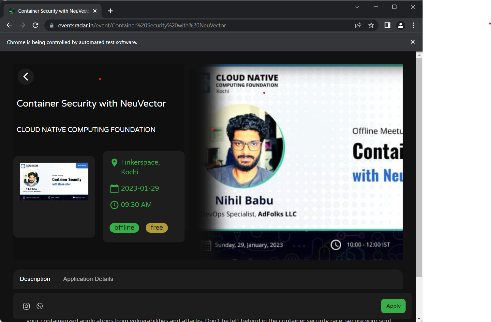

# Automated Testing with Selenium

### Submitted by: Sunith vs, CSB, 20220098 (Roll no)

### Date: 31/01/2023

## Introduction:

In this project, a Selenium script was created to automatically test the [eventsradar.in](http://eventsradar.in/) the website for the availability of event pages. The website, which is built on the Next.js framework, requires a rebuilding of the production environment every time a new event is added. The script uses the Chrome WebDriver API to check the presence of the body element on each event page and reports to the admin if a page is not available.

### This is the code

```python
from selenium import webdriver
from selenium.common.exceptions import TimeoutException
from selenium.webdriver.chrome.service import Service as ChromeService
from selenium.webdriver.common.by import By
from selenium.webdriver.support import expected_conditions as EC
from selenium.webdriver.support.ui import WebDriverWait

from webdriver_manager.chrome import ChromeDriverManager
from selenium import webdriver
from selenium.webdriver.chrome.service import Service as ChromeService
import requests

def website_exists(url):
    browser = webdriver.Chrome(service=ChromeService(ChromeDriverManager().install()))
    browser.implicitly_wait(5)
    driver = browser

    # Set the timeout to 10 seconds
    timeout = 5

    try:
        # Load the website
        driver.get(url)

        # Wait until the page has loaded
        WebDriverWait(driver, timeout).until(
            EC.presence_of_element_located((By.CLASS_NAME, "next-error-h1"))
        )

        print("Website not exists")
        return False
    except TimeoutException:
        print("Website exists")
        # If a TimeoutException is thrown, the website does not exist
        return True
    finally:
        # Clean up the webdriver instance
        driver.quit()

events_pages = requests.get("https://api.eventsradar.in/api/events/title/").json()
events_pages.insert(0, "test")
for event in events_pages:
    print("Checking", event + "...")
    status = website_exists(f"https://eventsradar.in/event/{event}")
    print("Status:", status, "\n\n")

```

### The output of the automation testing is as follows

```python
Checking test...
Website not exists
Status: False 

Checking Container Security with NeuVector...
Website exists
Status: True 

Checking Students Space Summit 2023...
Website exists
Status: True 

Checking Odyssey...
Website exists
Status: True 

Checking AutoCAD  Workshop...
Website exists
Status: True 

Checking Nss-Quiz-Competition...
Website exists
Status: True
```

screen shots of the testing



selenium code checks the event page is available or not

The goal of the project is to ensure a seamless user experience at the [eventsradar.in](http://eventsradar.in/) the website by promptly identifying and fixing any page loading issues. The Selenium script automates the manual effort of checking each event page and eliminates the need for manual testing. The script uses the Chrome WebDriver API to load the website and wait for the presence of the body element on each event page. If a TimeoutException is thrown, the website does not exist, and the script reports this to the admin.

## Conclusion:

Automated website testing with Selenium provides a quick and efficient way to ensure the functionality of a website. In this project, a Selenium script was created to test the [eventsradar.in](http://eventsradar.in/) the website and report any page loading issues to the admin. The script uses the Chrome WebDriver API to load the website and check the presence of the body element on each event page. The project aimed to provide a seamless user experience by promptly identifying and fixing any page loading issues and has successfully achieved its goal.
